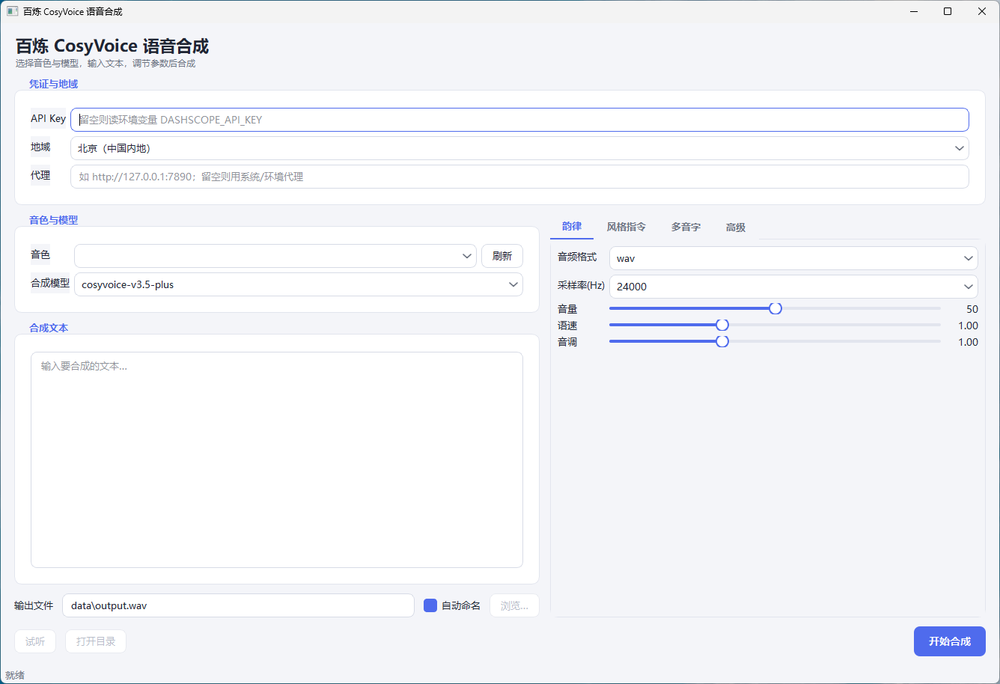

# DashScope 语音工具箱




阿里云百炼（DashScope）语音能力的轻量封装，含两部分：

- **核心库 `dashscope_audio`** —— 用 `requests` 直连百炼 HTTP API，覆盖 CosyVoice / Qwen-TTS 非实时合成、声音复刻、OpenAI 兼容模式 LLM 调用。
- **桌面应用 `gui`** —— 基于 PySide6 的 CosyVoice 语音合成界面：选音色、调全部合成参数、多音字 AI 纠音、按文本情感生成风格指令、试听、自动命名输出。

| 能力 | 模块 | 端点 |
| --- | --- | --- |
| 非实时语音合成 CosyVoice | `cosyvoice_tts` | `/services/audio/tts/SpeechSynthesizer` |
| 非实时语音合成 Qwen-TTS | `qwen_tts` | `/services/aigc/multimodal-generation/generation` |
| 声音复刻（CosyVoice 音色管理） | `voice_clone` | `/services/audio/tts/customization` |
| OpenAI 兼容模式（多音字 / 风格指令） | `llm` | `/compatible-mode/v1/chat/completions` |
| 音频后处理（开头补静默） | `audio_post` | 本地 ffmpeg |

## 功能特性

- 合成接口用 `**options` 透传文档其余参数（`enable_ssml` / `language_hints` / `instruction` / `hot_fix` / `seed` 等），无需逐一封装。
- 统一错误模型 `DashScopeError`（含 `code` / `message` / `request_id`），常见错误码自动转中文排查提示。
- 音频下载内置重试与代理支持（`Settings.proxy`，缺省回退环境变量代理）。
- 桌面应用全程后台线程调用，界面不冻结；支持词级多音字纠音（`hot_fix`）与 Qwen 上下文识别。

## 目录结构

```
.
├── main.py              # 核心库 CLI 入口（子命令分发，调用样例）
├── run_gui.py           # 桌面应用入口
├── pyproject.toml       # 项目元数据 + 依赖声明
├── environment.yml      # conda 环境定义（name: trade）
├── .env.example         # 环境变量模板
├── dashscope_audio/     # 核心库
│   ├── config.py        # API Key / 地域 / base url
│   ├── _client.py       # 公共层：鉴权、错误、SSE 解析、下载（含代理与重试）
│   ├── cosyvoice_tts.py # CosyVoice 合成（流式 / 非流式）
│   ├── qwen_tts.py      # Qwen-TTS 合成（流式 / 非流式）
│   ├── voice_clone.py   # 声音复刻 create / list / delete
│   ├── audio_post.py    # ffmpeg 后处理（开头补静默）
│   └── llm.py           # OpenAI 兼容模式 Qwen（多音字识别 / 风格指令）
├── gui/                 # PySide6 桌面应用
│   ├── app.py           # 主窗口
│   ├── controller.py    # 后台线程封装 + 错误转译
│   ├── params_panel.py  # 合成参数面板（韵律/风格/多音字/高级）
│   ├── pinyin_util.py   # 多音字扫描与 LLM 识别
│   ├── instruction_util.py  # AI 风格指令生成
│   ├── models.py / style.py / widgets.py / heteronyms.py
│   └── assets/
├── examples/            # 独立示例脚本
├── docs/                # 详细文档（API 笔记 + GUI 说明）
├── tests/               # 测试（独立可跑脚本）
└── data/                # 本地音频产物（已被 .gitignore 排除）
```

## 环境准备

二选一。

**conda（推荐，与开发环境一致）**

```bash
conda env update -f environment.yml   # 环境名 trade
conda activate trade
pip install PySide6                    # 仅桌面应用需要（体积较大，按需安装）
```

**pip**

```bash
pip install -e .            # 核心库（requests + pypinyin）
pip install -e ".[gui]"     # 附带桌面应用依赖 PySide6
```

> 桌面应用的试听与「开头补静默」依赖系统 ffmpeg：PySide6 Addons 自带 QtMultimedia 用于播放；补静默调用 PATH 中的 `ffmpeg`，未安装时会回退为不补静默并给出提示。

## 配置 API Key

Key 从环境变量 `DASHSCOPE_API_KEY` 注入，**不要硬编码进源码**。北京与新加坡地域的 Key 不通用。

```powershell
# PowerShell（当前会话）
$env:DASHSCOPE_API_KEY = "sk-xxx"
```

```bash
# bash（当前会话）
export DASHSCOPE_API_KEY="sk-xxx"
```

也可复制 `.env.example` 为 `.env` 记录变量（需自行 `export`/`set` 或借助 python-dotenv 加载）。桌面应用可直接在界面「API Key」框填写。

## 快速开始

**命令行（核心库样例）**

```bash
python main.py            # 默认：Qwen-TTS 合成样例
python main.py qwen       # Qwen-TTS（非流式 + 流式）
python main.py cosyvoice  # CosyVoice（非流式 + 流式 mp3）
python main.py list       # 仅查询当前音色列表（只读、不计费）
python main.py clone      # 声音复刻：create -> list -> delete
python main.py all        # 依次跑两个合成样例
```

**桌面应用**

```bash
python run_gui.py
```

填入 API Key（或先设好环境变量）→ 拉取音色 → 选音色与合成模型 → 输入文本 → 调参 → 开始合成。详见 [docs/gui.md](docs/gui.md)。

## 作为库调用

```python
from dashscope_audio import load_settings, qwen_tts, cosyvoice_tts, voice_clone, Region

settings = load_settings()                       # 默认北京地域，读环境变量 Key
# settings = load_settings(region=Region.SINGAPORE, api_key="sk-xxx")  # 显式指定

# 1) Qwen-TTS 非实时合成
res = qwen_tts.synthesize_to_file(settings, text="你好世界", dest_path="a.wav", voice="Cherry")
print(res.audio_url)

# 2) CosyVoice 非实时合成（可控 format/采样率/语速等）
cosyvoice_tts.synthesize_to_file(
    settings, text="你好", voice="longanyang", dest_path="c.wav",
    model="cosyvoice-v3-flash", format="wav", sample_rate=24000,
)

# 3) 声音复刻（CosyVoice）：创建 -> 轮询就绪 -> 合成 -> 删除
info = voice_clone.create_voice(
    settings,
    url="https://your-oss/sample.wav",   # 公网可访问的样本音频 URL
    target_model="cosyvoice-v3.5-plus",  # 须与下面合成的 model 一致
    prefix="myvoice",                    # 仅数字/字母，<=10 字符
)
ready = voice_clone.wait_until_ready(settings, info.voice_id)   # 异步任务，轮询至 OK
cosyvoice_tts.synthesize_to_file(
    settings, text="你好", voice=info.voice_id, dest_path="d.wav",
    model="cosyvoice-v3.5-plus", format="wav",
)
voice_clone.delete_voice(settings, info.voice_id)
```

## 关键约定

- **可选参数透传**：CosyVoice 合成函数用 `**options` 透传文档其余参数，无需逐一封装。
- **声音复刻的两个模型别混**：`model` 固定 `voice-enrollment`（复刻引擎）；`target_model` 是驱动音色的 CosyVoice 合成模型，**必须与后续合成时的 `model` 一致**。
- **声音复刻是异步任务**：`create_voice` 返回 `voice_id` 后需 `wait_until_ready` 等到 `status=OK` 才能合成；样本音频通过**公网 URL** 提交（建议 OSS）。创建/查询/更新/删除均免费。
- **复刻音频要求**：单声道、≥16kHz、10~20s、无背景噪音，有效语音占比 >60%。
- **合成返回**：返回音频 URL（有效期 24h），`*_to_file` 自动下载；流式接口 `output.audio.data` 为 Base64 音频块。
- **多音字纠音是按词匹配**：`hot_fix.pronunciation` 以「词/字」为单位（TONE3 拼音、空格分隔多字词）；同字不同音时用包含该字的词区分（如 `至于→zhi4 yu2`、`于嗟→xu1 jie1`）。`cosyvoice-v2` 不支持 hot_fix。

## 常见错误

| 错误码 | 含义 | 处理 |
| --- | --- | --- |
| `AllocationQuota.FreeTierOnly` | 免费额度用尽且开了「仅用免费额度」 | 控制台关闭该模式或开通付费 |
| HTTP 401 / `InvalidApiKey` | 鉴权失败 | 检查 Key 是否正确、地域是否匹配 |
| `Throttling.RateQuota` | 触发限流 | 稍后重试 / 降并发 |
| `Audio.*` / `InvalidParameter` | 参数或音频不合规 | 检查文本长度、音色名、音频格式时长 |

完整错误码：<https://help.aliyun.com/zh/model-studio/error-code>

## 文档

| 文档 | 内容 |
| --- | --- |
| [docs/gui.md](docs/gui.md) | 桌面应用使用说明（参数、多音字纠音、AI 扫描、自动命名、代理） |
| [docs/cosyvoice.md](docs/cosyvoice.md) | CosyVoice 合成 API 笔记 |
| [docs/voice_clone.md](docs/voice_clone.md) | 声音复刻 API 笔记 |
| [docs/voices.md](docs/voices.md) | CosyVoice 音色查询说明 |

## 测试

测试为独立可执行脚本（无需 pytest，退出码 0 即通过）：

```bash
conda run -n trade python tests/test_pinyin_util.py
conda run -n trade python tests/test_error_recovery.py
conda run -n trade python tests/test_llm.py
conda run -n trade python tests/test_instruction.py
conda run -n trade python tests/test_model_combo.py
```

## License

[MIT](LICENSE)
